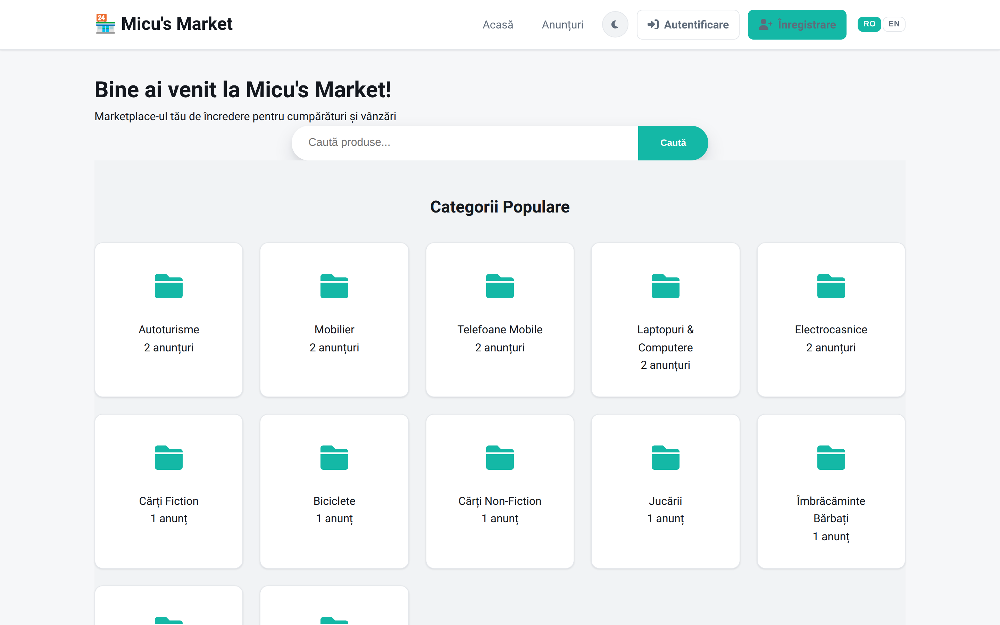
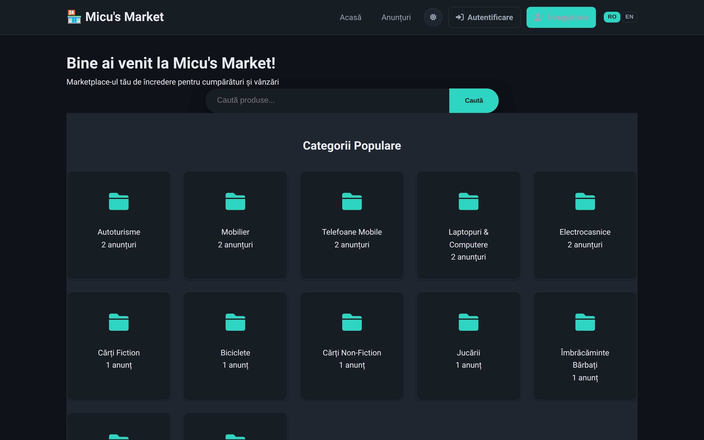
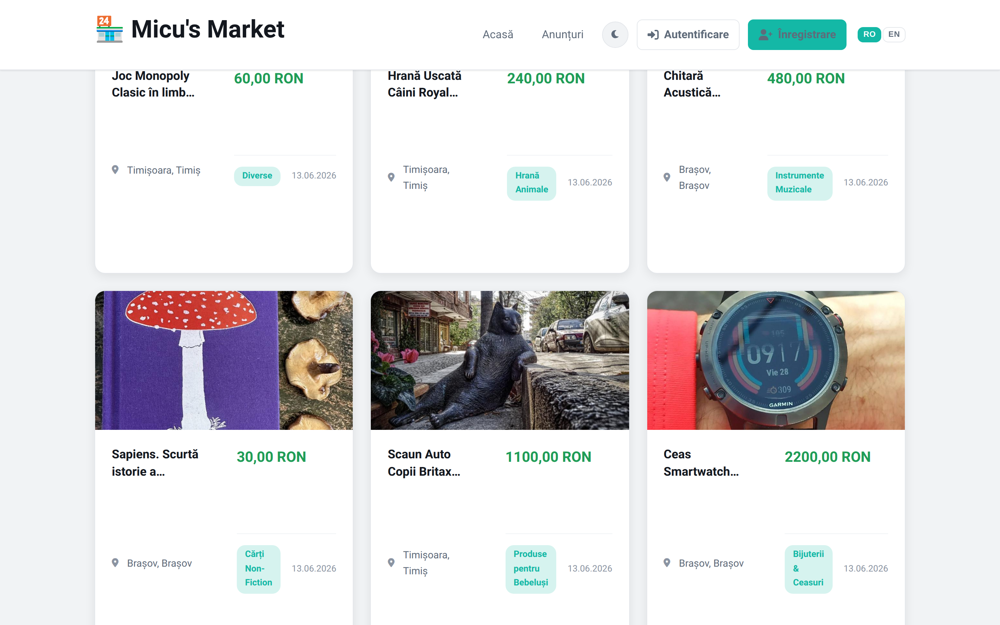
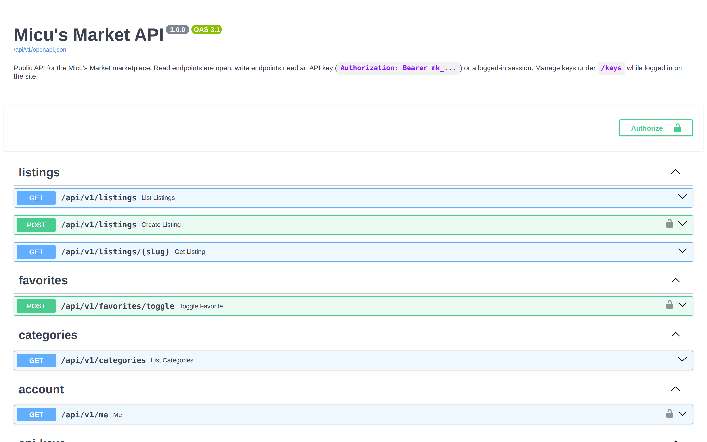
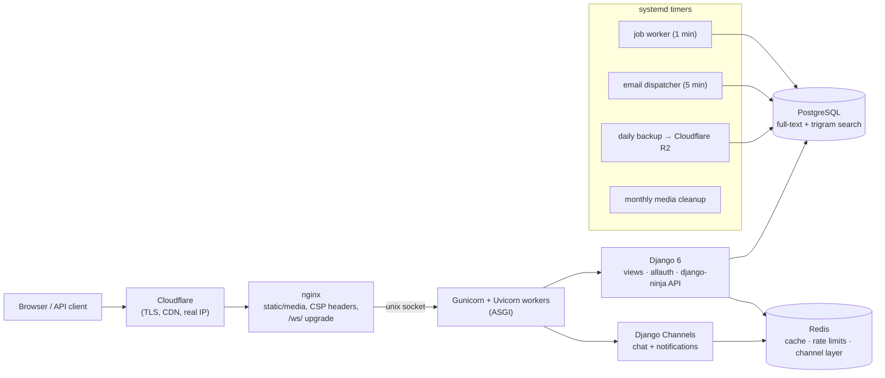

# 🏪 Micu's Market

[](https://github.com/Alexandru2984/micu-s_market/actions/workflows/ci.yml)


[](LICENSE)

A production-deployed classifieds marketplace (Romanian market) built with **Django 6**, running live at **[market.micutu.com](https://market.micutu.com)** — real-time chat over WebSockets, full-text search, a versioned public API with interactive docs, moderation & anti-abuse tooling, and a fully automated ops setup (backups, background jobs, health checks) on a self-managed VPS.

**Live demo:** <https://market.micutu.com> · **API docs (Swagger):** <https://market.micutu.com/api/v1/docs>

| Home (light) | Home (dark) |
| --- | --- |
|  |  |

| Listings | API docs |
| --- | --- |
|  |  |

---

## Architecture



## Engineering highlights

Things worth reading the source for:

- **Database-backed job queue** (`jobs/`) — no Celery dependency: `SELECT ... FOR UPDATE SKIP LOCKED` claiming, priorities, retries with backoff, stale-job recovery, driven by a systemd timer. ~130 lines.
- **Idempotent signed payment webhooks** (`billing/`) — HMAC-SHA256 over `timestamp.body` with constant-time compare, timestamp tolerance window, event deduplication by `event_id`, row locking on order updates.
- **Hybrid Postgres search** (`listings/search.py`) — weighted `tsvector` ranking (title > category > city > description) combined with trigram similarity for typo tolerance, with a portable `icontains` fallback.
- **API keys hashed at rest** (`api/models.py`) — `mk_<prefix>_<secret>` bearer tokens, SHA-256 stored, shown once at creation; key management is session-only so a leaked key cannot mint new keys.
- **Real-time chat with graceful degradation** (`chat/`) — WebSocket consumer with per-connection and per-user rate limiting, typing indicators, read receipts; falls back to AJAX automatically if the socket is unavailable. Attachments are private, served only by Django after a participant check (blocked at nginx level).
- **Layered anti-abuse** — django-ratelimit on every write path, risk scoring of new listings against configurable scam-term lists, auto-hide after N user reports, user strikes, audit log of moderation actions.
- **Ops as code** (`deploy/`, `scripts/`) — systemd units/timers, nginx configs, release script with preflight checks and rollback, smoke checks, verified daily Postgres backups shipped offsite to Cloudflare R2.

## Features

- **Auth & security** — email-only login with mandatory verification (django-allauth), optional 2FA (TOTP + recovery codes), Argon2 hashing, granular rate limits on login/signup/email, configurable admin URL, strict CSP + security headers, Cloudflare real-IP restoration.
- **Listings** — hierarchical categories, up to 10 images per listing (server-side Pillow validation + optimization), price/city/county filters, featured/promotion states with expiry, view counters with cooldown.
- **Search** — Postgres full-text + trigram, relevance sorting, saved searches.
- **Chat** — live messages, typing indicator, read receipts (✓✓), secure file attachments, unread counters pushed over a notifications WebSocket.
- **Reviews** — transaction-scoped 1–5★ ratings, one official reply per review, self-review/duplicate prevention.
- **Notifications** — in-app + background email dispatcher with URL allow-listing.
- **Moderation** — report queue for listings and users, auto-hide thresholds, moderation notes, admin dashboards.
- **i18n** — Romanian (source) and English, language switcher.
- **UX** — design-token CSS system, dark mode (no flash), PWA (manifest + service worker + offline page), self-hosted fonts/icons.
- **SEO** — dynamic sitemap/robots, OG/Twitter meta, canonical URLs.

## Public API (`/api/v1`)

Versioned API built with **django-ninja** (OpenAPI 3.1). Read endpoints are public; writes need a bearer key or session. Interactive docs: [`/api/v1/docs`](https://market.micutu.com/api/v1/docs).

```bash
# Search listings
curl "https://market.micutu.com/api/v1/listings?q=laptop&min_price=100&sort=price"

# Create a listing (get a key from /api/v1/keys while logged in)
curl -X POST "https://market.micutu.com/api/v1/listings" \
  -H "Authorization: Bearer mk_..." \
  -H "Content-Type: application/json" \
  -d '{"title": "Laptop", "description": "...", "price": "1200.00"}'
```

The legacy unversioned `/api/` JSON endpoints remain for the site's own AJAX.

## Tech stack

| Layer | Choice |
| --- | --- |
| Backend | Python 3.13 · Django 6 · django-ninja · django-allauth |
| Real-time | Django Channels + Redis channel layer |
| Data | PostgreSQL 17 (FTS + pg_trgm) · Redis (cache, rate limits) |
| Serving | Gunicorn (Uvicorn ASGI workers) ← unix socket ← nginx ← Cloudflare |
| Static/media | WhiteNoise (hashed manifests) · Pillow · optional S3/R2 media backend |
| Observability | Sentry · request-ID logging · `/healthz` (DB + cache probe) · audit log |
| Quality | ruff · coverage (70% floor) · bandit · pip-audit · GitHub Actions (Python 3.13/3.14 matrix) |

## Local setup

```bash
git clone https://github.com/Alexandru2984/micu-s_market.git && cd micu-s_market
python3 -m venv venv && source venv/bin/activate
pip install -r requirements.txt

cp .env.example .env   # fill in at least: DJANGO_SECRET_KEY, DB_*, CHANNELS_IN_MEMORY=1

python manage.py migrate
python populate_categories_script.py   # optional: default categories
python manage.py createsuperuser
python manage.py runserver
```

### Tests & linting

```bash
python manage.py test --settings=Micu_market.settings_test   # no Redis/.env needed
ruff check .
coverage run manage.py test --settings=Micu_market.settings_test && coverage report
```

CI runs the same plus `manage.py check --deploy`, migration drift checks, `bandit`, and `pip-audit` on every push.

## Production

Deployed on a self-managed VPS: systemd service (Gunicorn/ASGI over a unix socket), nginx in front (static/media, WebSocket upgrade block, CSP as the single enforced header source), PostgreSQL and Redis as system services, four systemd timers (job worker, email dispatcher, daily backup with R2 offsite upload + verification, media cleanup). Release flow: `scripts/deploy_release.sh` (preflight → migrate → collectstatic → restart → smoke check), with `scripts/rollback_release.sh` on standby.

Docker Compose (`docker-compose.yml`) is provided as an alternative bootstrap; the runbook lives in [`deploy/ops-runbook.md`](deploy/ops-runbook.md).

## License

[MIT](LICENSE)
